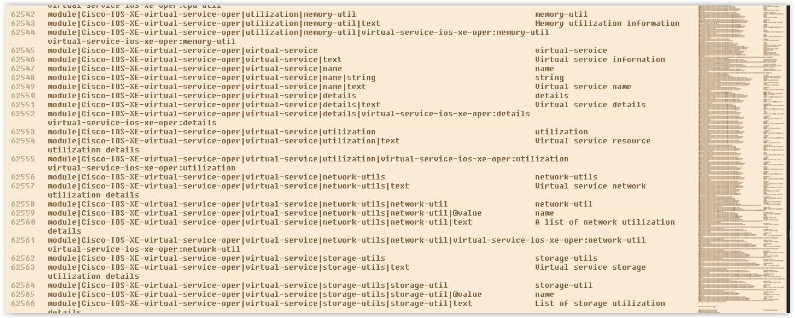
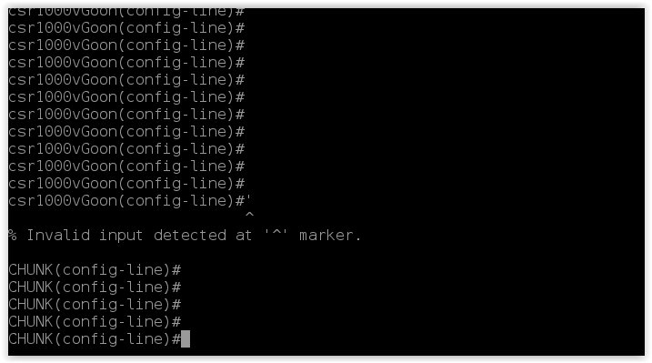
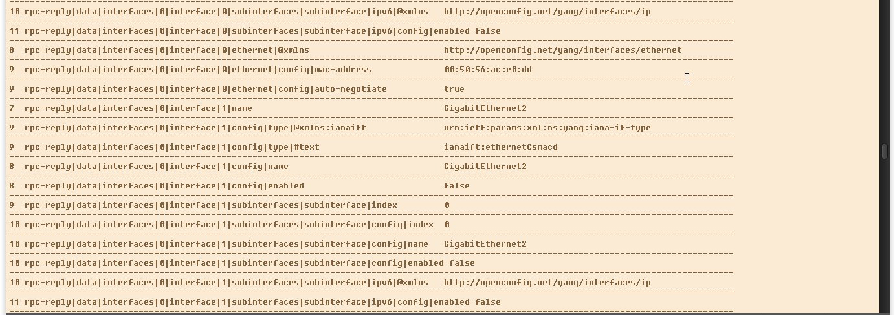

# NETCONF

I strictly did this to simply understand this exciting Southbound API called Netconf for network automation purposes. 

The crowning achievement here is the main file called netconf.py, explained in the bottom of README.md.

Netconf.py has three classes called SSH, Command Line & Netconf. The last two classes are subclasses of SSH, and that uses/wraps the default SSH Python Library called Paramiko. 

The Command Line Class (extending SSH) is perfect for interacting with a Cisco Router, using safer procotols like SSH instead of Telnet when the need arises (or you could use Netmiko of course)

Of course, the real treat here is the Netconf class inside of Netconf.py, which has a different login mechanism & different port & slightly differnet logic & separated concerns which necessitated it to be it's own class (not a god-object anti-pattern in one class)

Now that you have the Netconf class to interact with any vendor's network device, you have to send Netconf XML/RPC to it.

What is the XML payload that you send? That is the million dollar question.

I downloaded the Cisco YANG files in Github, and found them unreliable to help me determine the XML to send to Netconf to change the router/switches "database" so to speak. I had to convert the Yang files to something else.

Enter the PYang tool. Of course, it allows to convert Yang Models into many many formats, such as Text-Based Graphs called Trees. They were also converted into XML. BOTH are very helpful in determining the Netconf XML Payload for me (so far). 

yang_to_xml.py converts all the native Yang Models into Trees & XML (python & subprocess instead of manually)

The Tree Format was helpful in helping me determine which attributes were Read Only & Read/Write, and the XML format was helpful in helping me find the proper hierarchy of XML in a very easy to read format. The text-based Tree was too cumbersome for that purpose.

xml_to_graph.py converted XML-formatted Yang files into a neat graph like this:



Xml_to_graph gets the levels of tags in that large XML, and iterates through many XML files to make determining the Netconf XML payload easier.

My ways of getting the XML Payload to send to Netconf ranged from using that converted Yang Models, as well as doing a get request to NetCONF and using that XML response to do what I would like.

I know I could have also done this with the command line too of course, but NETCONF offers another option that's programmatic & scalable for many many devices in a fleet. As well as vendor-neutral with the openconfig Yang Models (with less attributes to change/slimmer), but vendor-neutral. I can be willing to bet that there are ways to change values that might be impossible or unwieldy to do with the command line, and I can see this greatly assisting in troubleshooting as well.

I happily changed the hostname, description of Cisco CSR 1000V with Netconf XML, then changed the IP address every 5 seconds dynamically as a joke to experient (LOL). The possibilities with this are nearly endless.

### Hostname 



### rpc_reply (xml converted by me to see the hierarchy neatly)



### graph.txt (to create XML playload)


### Code to change the IP addresses (unfortunately I can't find a picture of it changing. Take my word :) )

```
from itertools import cycle
	for octet_4 in cycle(range(4,255)):
	  rpc_fragment = f'
		<interfaces xmlns="urn:ietf:params:xml:ns:yang:ietf-interfaces">
		  <interface operation="replace">
			  <name>
			   GigabitEthernet2
			  </name>
			  <description>
				GOON
			  </description>
			  <type xmlns:ianaift="urn:ietf:params:xml:ns:yang:iana-if-type">
				ianaift:ethernetCsmacd
			  </type>
			  <enabled>
				true
			  </enabled>
			  <ipv4 xmlns="urn:ietf:params:xml:ns:yang:ietf-ip">
				<address>
				  <ip>
					10.10.50.{octet_4}
				  </ip>
				  <netmask>
					255.255.255.0
				  </netmask>
				</address>
			  </ipv4>
		  </interface>
		</interfaces>
	  '
	  xml_response = cs.edit_config(rpc_fragment)
	  print(xml_response)
```


# Netconf.py
### SSH 
This is the base class for this project which uses Paramiko. Classes that use the Cisco Command Line & Cisco Netconf will extend this superclass
```python
class SSH():
	client = None
	session = None
	read_interval = .6
	connect_params = {"hostname":"192.168.0.201", "username":"goon", "password":"goon","port":22,"look_for_keys":False, "allow_agent":False}
	def read(self):
		blocks = []
		chunk_size = 900000
		while True:
			sleep(self.read_interval)
			block = self.session.recv(chunk_size)
			#DEBUG
			# print(block.decode(),end="")
			# file_add_contents("add.xml",block.decode())
			#end debug
			blocks.append(block.decode())
			if len(block) < chunk_size:
				break
		text = ''.join(blocks).strip()
		return text
	def start(self, *args,**kwargs):
		self.client = paramiko.SSHClient()
		#overrides the default above
		self.connect_params.update(kwargs)
		hostname = self.connect_params.get("hostname")
		del self.connect_params['hostname']
		#debug
		print("LOGGING INTO:")
		print(hostname,self.connect_params)
		self.client.set_missing_host_key_policy(paramiko.AutoAddPolicy())
		self.client.connect(hostname,**self.connect_params)
		self.session = self.client.get_transport().open_session()
		# Only uncomment if sending command line arguments. Separate into separate class or function if expands.
	def s(self, *args,**kwargs):
		'''console shorthand'''
		self.start(*args,**kwargs)
	def close(self):
		self.client.close()
		print("SSH Session Closed")
```

### Command Line
This is a subclass of the SSH class, and this will be called when ever Python needs to interact with the Cisco Command Line, as opposed to interacting with Netconf. As soon as Netconf has a different interaction model with different ports, it became apparent to separate out the SSH logic from the Command Line & NetConf for extensibility &decoupling & leanness.

```python
class CommandLine(SSH):
'''Command Line Specific'''
#port 22
connect_params = {'hostname': '10.10.20.48', 'username': 'cisco', 'password': 'cisco_1234!', 'port': 22, 'look_for_keys': False, 'allow_agent': False}
def __init__(self, *args,**kwargs):
	self.start(*args,**kwargs)
	#invoke shell is specific to Command Lines (not netconf)
	self.session.invoke_shell()
def send(self,command):
	command = command + "\n"
	self.session.send(command.encode())
	response = self.read()
	return response
```

### Netconf
```python
class Netconf(SSH):
	'''Class & Functions & Values specific to NETCONF'''
	#
	#Cisco DevNet Params
	#port 830
	#
	cisco_namespace_prefix = 'http://cisco.com/ns/yang/'
	ietf_namespace_prefix = 'urn:ietf:params:xml:ns:yang:'
	connect_params = {'hostname': '10.10.20.48', 'username': 'cisco', 'password': 'cisco_1234!', 'port': 830, 'look_for_keys': False, 'allow_agent': False}
	terminator = ']]>]]>'
	def __init__(self, *args,**kwargs):
		#Cisco Devnet Params
		self.start(*args,**kwargs)
		self.netconf_hello()
	def n(self):
		'''console restart socket & netflow shorthand'''
		self.start()
		self.netconf_hello()
	def send(self,command):
		command = command + self.terminator + "/n"
		self.session.send(command.encode())
		response = self.read()
		return response
	def netconf_hello(self):
		self.session.invoke_subsystem('netconf')
		hello_rpc = '<?xml version="1.0" encoding="UTF-8"?><hello xmlns="urn:ietf:params:xml:ns:netconf:base:1.0"><capabilities><capability>urn:ietf:params:netconf:base:1.0</capability></capabilities></hello>'
		return self.send(hello_rpc)
	def change_hostname(self,hostname):
		self.send(f'<?xml version="1.0" encoding="UTF-8"?> <rpc message-id="101" xmlns="urn:ietf:params:xml:ns:netconf:base:1.0"> <edit-config> <target> <running/> </target> <config> <cli-config-data> <cmd>hostname {hostname}</cmd> </cli-config-data> </config> </edit-config> </rpc>')
	def print_netconf_graph(self,xml_response):
		xml_response = xml_response.replace(self.terminator,'')
		try:
			print_structure(xmltodict.parse(xml_response))
		except xml.parsers.expat.ExpatError:
			print("Your XML is structured wrong")
	def console_send(self,xml_filepath="payload.txt"):
		'''meant for consoles. filename with XML to send must be in payload.txt'''
		self.print_netconf_graph(n.send(file_get_contents(xml_filepath)))
	def get(self,filter):
		rpc_get = '<?xml version="1.0" encoding="UTF-8"?><rpc message-id="101" xmlns="urn:ietf:params:xml:ns:netconf:base:1.0"><get><filter>' + filter + '</filter></get></rpc>'
		return self.send(rpc_get)
	def edit_config(self,filter):
		rpc_edit_config = '<?xml version="1.0" encoding="UTF-8"?><rpc xmlns="urn:ietf:params:xml:ns:netconf:base:1.0" message-id="111"><edit-config><target><running/></target><config>' + filter + '</config></edit-config></rpc>'
		return self.send(rpc_edit_config)
	def pretty_print_xml(self,ugly_xml):
		bs = BeautifulSoup(ugly_xml, 'xml')
		print(bs.prettify())
```